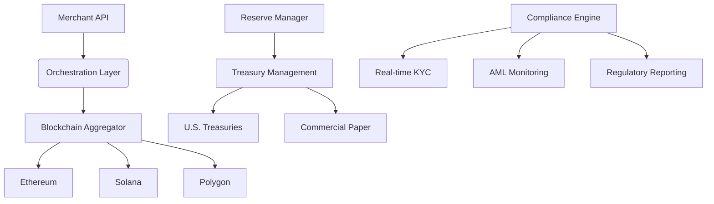

# The Largest Web3 Acquisition in History: Stripe's $1.1 Billion Bet on Stablecoin Infrastructure  

## Understanding Bridge: The Web3 Payment Protocol Behind Stripe's Landmark Deal  

In October 2024, the crypto industry witnessed a seismic shift as Stripe, the global payment giant, acquired Bridge—a stablecoin infrastructure platform—for $1.1 billion. This transaction not only marks Stripe's largest acquisition to date but also establishes a new benchmark for Web3 deal-making. To comprehend the significance of this move, let's explore Bridge's evolution, technological capabilities, and strategic value within the decentralized finance ecosystem.  

### Foundational Background of Bridge  

Founded by seasoned fintech veterans **Zach Abrams** (CEO) and **Sean Yu** (CTO), Bridge emerged from two years of stealth development to address critical gaps in crypto payment infrastructure. Abrams' career spans leadership roles at Coinbase, Square, and Brex, while Yu's engineering expertise includes tenures at Airbnb, DoorDash, and Coinbase. Their prior collaboration on Square-acquired P2P payment platform Evenly (2012) demonstrated their ability to revolutionize financial systems.  

Bridge's mission crystallized around solving three persistent challenges in stablecoin adoption:  
1. **Seamless integration** for businesses  
2. **Regulatory compliance** across jurisdictions  
3. **Cost-effective cross-border transactions**  

### Core Technology: Building the Web3 Payment Stack  

Bridge positioned itself as the "Stripe for Web3" through its dual API architecture:  

| API Type          | Functionality                                                                 | Business Impact                          |  
|-------------------|-------------------------------------------------------------------------------|------------------------------------------|  
| Orchestration API | Automates stablecoin transfers across multiple blockchains                     | Enables instant cross-chain transactions |  
| Issuance API      | Simplifies creation of proprietary stablecoins with yield-generating reserves | Expands revenue streams for businesses   |  

This infrastructure allows companies to:  
- Convert fiat currencies to stablecoins (USDC, USDT, EURC) in real-time  
- Maintain multi-currency balances for global operations  
- Automate compliance and regulatory reporting  

### Market Validation Through Adoption  

Bridge's value proposition has attracted both enterprise clients and industry partnerships:  
- **SpaceX**: Utilizes Bridge for cross-border fund transfers and jurisdiction-specific currency management  
- **Coinbase**: Leverages Bridge's APIs for stablecoin bridging between Tron (USDT) and Base (USDC)  
- **Stellar & Strike**: Collaborate on expanding stablecoin payment rails  

By Q3 2024, Bridge processed over **$50 billion in annualized transaction volume**, demonstrating market readiness for its solutions. The platform maintains a robust regulatory footprint with:  
- 48 U.S. state licenses  
- VASP license in Poland  
- Pending approvals in New York and EU jurisdictions  

### Strategic Rationale Behind Stripe's Acquisition  

Stripe's acquisition of Bridge aligns with three strategic imperatives:  
1. **Web3 Expansion**: Accelerates Stripe's entry into crypto payments, complementing its existing USDC support for 150+ countries  
2. **Infrastructure Control**: Secures critical middleware for stablecoin transactions across Ethereum, Solana, and Polygon  
3. **Revenue Diversification**: Positions Stripe to capture yield from stablecoin reserve management  

This acquisition follows Stripe's pattern of strategic fintech investments, including its 2022 acquisition of Nigerian payment platform Paystack. However, Bridge represents Stripe's most ambitious move into decentralized finance to date.  

## Frequently Asked Questions  

### Why Did Stripe Pay $1.1 Billion for Bridge?  
The valuation reflects Bridge's technical maturity, regulatory compliance framework, and existing enterprise adoption. By acquiring Bridge rather than building in-house, Stripe gains:  
- Immediate access to 48 U.S. state licenses  
- Pre-built API integrations with major blockchain networks  
- Proven enterprise client relationships (e.g., SpaceX)  

### How Does Bridge Differ from Traditional Payment Processors?  
Unlike Stripe's traditional card payment model, Bridge operates through:  
- **Tokenized settlement**: Instantaneous blockchain-based transactions  
- **Programmable compliance**: Automated KYC/AML checks via smart contracts  
- **Yield generation**: Reserve assets invested in U.S. Treasuries for issuers  

### What Does This Mean for Global Payments?  
Bridge's technology enables:  
- **Sub-second cross-border transfers** at fractions of traditional costs  
- **Multi-currency wallets** with native stablecoin support  
- **Automated tax reporting** through on-chain transaction records  

### Will Bridge Maintain Independence Post-Acquisition?  
Historically, Stripe has allowed acquired companies operational autonomy. Similar to Paystack's continued operation in Nigeria, Bridge is expected to:  
- Retain its engineering team  
- Maintain existing client contracts  
- Continue developing multi-chain capabilities  

### How Does This Affect Competitors Like Circle and Coinbase?  
While Circle (USDC issuer) and Coinbase maintain infrastructure advantages, Stripe's acquisition creates a new category:  
| Aspect              | Traditional Providers (e.g., Circle) | Stripe + Bridge                           |  
|---------------------|---------------------------------------|--------------------------------------------|  
| Integration Depth   | Wallet-to-wallet transfers             | API-first enterprise solutions             |  
| Geographic Reach    | 150+ countries via partnerships        | Native regulatory licenses in 48 U.S. states|  
| Revenue Model       | Stablecoin issuance fees               | Transaction fees + yield-sharing agreements|  

## Expansion Strategies and Future Outlook  

### Bridging the Global Payments Gap  

Bridge's technology addresses critical pain points in emerging markets:  
- **Africa**: Enables businesses to accept USD/EUR stablecoins without traditional banking infrastructure  
- **Latin America**: Partners with Bitso to facilitate B2B payments across borders  
- **Asia-Pacific**: Leverages Stellar network for high-throughput remittances  

With Stripe's resources, Bridge plans to:  
1. Expand blockchain network support (e.g., Aptos, Sui)  
2. Develop fiat-to-stablecoin on/off ramps  
3. Integrate AI-powered fraud detection systems  

### Regulatory Challenges and Mitigation  

While Bridge maintains a strong compliance foundation, global expansion faces hurdles:  
- **New York BitLicense**: Pending approval may delay U.S. institutional adoption  
- **EU MiCA Regulations**: Requires adjustments to stablecoin reserve transparency  
- **Cross-border AML**: Necessitates real-time transaction monitoring across 150+ jurisdictions  

Bridge's strategy includes:  
- Building modular compliance tools for jurisdiction-specific requirements  
- Partnering with Chainalysis for blockchain analytics  
- Developing zero-knowledge proof systems for privacy-preserving compliance  

### Financial Implications for Stripe  

The acquisition creates multiple revenue streams:  
1. **Transaction Fees**: 0.5-1.5% per stablecoin transfer (vs. 2-3% for credit cards)  
2. **Issuance Revenue**: 5-10 basis points on reserve asset yields  
3. **Enterprise Licensing**: Custom API packages for Fortune 500 companies  

Analysts project the Bridge acquisition could generate **$300-500 million in annual revenue** by 2026, with margins exceeding 60% due to low infrastructure costs.  

## Technical Deep Dive: How Bridge Works  

### Architecture Overview  

Bridge's system comprises three core components:  

### Key Innovations  

1. **Cross-chain Liquidity Pools**:  
   - Maintains native stablecoin reserves on each blockchain  
   - Eliminates reliance on centralized bridges through on-chain arbitrage  

2. **Dynamic Compliance Engine**:  
   - Processes 10,000+ KYC requests per second  
   - Integrates with 50+ global sanctions databases  

3. **Yield Optimization Layer**:  
   - Automatically allocates reserves to highest-yielding instruments  
   - Maintains 10% liquidity buffer for redemption requests  

### Performance Metrics  

- **Latency**: 2.3 seconds average transfer time across chains  
- **Throughput**: 15,000 transactions per second capacity  
- **Cost Efficiency**: $0.03 average transaction cost vs. $0.30 for traditional wire transfers  

## Industry Impact and Competitive Landscape  

### Disruption Potential  

Bridge's integration with Stripe could:  
- Reduce global payment costs by 80%  
- Enable real-time payroll systems in unstable currency environments  
- Create programmable money flows for DeFi applications  

### Competitive Differentiation  

| Feature                | Bridge+Stripe          | Circle USDC            | Coinbase Commerce      |  
|------------------------|------------------------|------------------------|------------------------|  
| Multi-chain Support    | 5+ blockchains           | Ethereum only          | 100+ chains            |  
| Enterprise Focus       | API-first              | Wallet-centric         | Hybrid model           |  
| Yield Generation       | Treasury-backed reserves| Collateralized reserves| No native yield        |  
| Compliance Infrastructure| 48 U.S. licenses        | 35 U.S. licenses       | 45 U.S. licenses       |  

### Strategic Vulnerabilities  

1. **Blockchain Dependency**: Heavy reliance on Ethereum (55% of transactions) exposes Bridge to gas price volatility  
2. **Centralization Concerns**: Critics argue Bridge's custodial model contradicts DeFi's non-custodial ethos  
3. **Regulatory Uncertainty**: Potential SEC actions against stablecoin issuers could impact business model  

## Implementation Roadmap  

### Phase 1: Integration (Q4 2024 - Q2 2025)  
- Merge Bridge APIs with Stripe's dashboard  
- Launch pilot programs with 50 enterprise clients  
- Expand compliance licenses to 10 new jurisdictions  

### Phase 2: Expansion (2025-2026)  
- Introduce fiat-to-stablecoin conversion widgets  
- Develop mobile SDKs for app developers  
- Launch treasury management services for institutions  

### Phase 3: Innovation (2026+)  
- Implement zero-knowledge proofs for private transfers  
- Develop AI-driven reserve management systems  
- Create programmable stablecoin contracts for DeFi integrations  

👉 [Explore the Future of Web3 Payments](https://bit.ly/okx-bonus)  

## Frequently Asked Questions  

### How Does Bridge Ensure Stablecoin Price Stability?  
Bridge employs a hybrid model combining:  
- **Collateralization**: 1:1 fiat reserves held in FDIC-insured banks  
- **Algorithmic Controls**: Dynamic mint/burn mechanisms during volatility  
- **Treasury Management**: Short-duration assets to maintain liquidity  

### Can Small Businesses Access Bridge's Technology?  
While initially enterprise-focused, Stripe plans to release:  
1. **Simplified API tier** for SMBs in Q3 2025  
2. **Pre-built Shopify/WooCommerce integrations**  
3. **Point-of-sale solutions** for physical retailers  

### What Security Measures Does Bridge Implement?  
Bridge's security framework includes:  
- **Multi-signature wallets** for reserve management  
- **Penetration testing** by ChainSecurity  
- **Real-time anomaly detection** using machine learning  

### How Does Bridge Compare to Traditional SWIFT Payments?  

| Metric               | Bridge Stablecoin Transfer | SWIFT Wire Transfer     |  
|----------------------|----------------------------|--------------------------|  
| Speed                | <5 seconds                 | 1-5 business days        |  
| Cost                 | $0.03                      | $15-50                   |  
| Availability         | 24/7                       | Business hours           |  
| Transparency         | On-chain audit trail       | Bank-controlled records  |  
| Reversibility        | Final settlement           | Possible chargebacks     |  

### What's the Path to Widespread Adoption?  
Bridge's adoption strategy focuses on:  
1. **Enterprise Partnerships**: Integrating with SAP, Oracle, and QuickBooks  
2. **Developer Ecosystem**: Launching grants program for dApp builders  
3. **Regulatory Advocacy**: Supporting stablecoin frameworks in the U.S. and EU  

## Conclusion: Reshaping the Financial Infrastructure  

Stripe's acquisition of Bridge represents more than a financial transaction—it signals a fundamental shift toward blockchain-based financial infrastructure. By combining Bridge's technical prowess with Stripe's enterprise distribution, this partnership has the potential to:  
- Enable universal access to stablecoin payments  
- Reduce global transaction costs by trillions annually  
- Create programmable money systems for the digital economy  

As the integration progresses, the crypto industry will closely monitor how this Web3 acquisition reshapes traditional financial services. Whether Bridge achieves its Stripe-like ambitions will depend on navigating regulatory complexities while maintaining technological innovation.  

👉 [Join the Web3 Payment Revolution](https://bit.ly/okx-bonus)